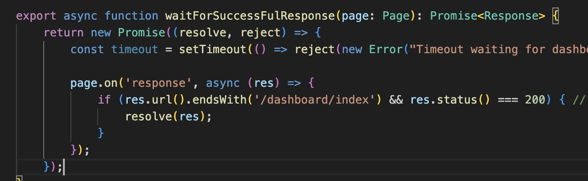

qa-playwrightFramework02
This is a Playwright-based test automation framework designed to demonstrate how to preserve session information using storage state.

📁 Folder Structure
1. node_modules
Auto-generated folder containing all the project dependencies.

2. distReports
Custom folder created to store HTML or other test execution reports.

3. playwright/.auth
Custom folder used to save the session or storage state.

Created manually for authentication storage.

4. tests
Contains all test case files.

When you run npx playwright test --headed, all tests under this folder will execute in headed mode.

5. Utils
Contains helper and setup utilities for the framework.

auth.setup.ts
This file performs two key tasks:

Saving the storage state (to avoid logging in repeatedly).

Verifying a successful API response using the function waitForSuccessFulResponse.

🔍 Understanding waitForSuccessFulResponse
<pre lang="markdown"> 
export async function waitForSuccessFulResponse(page: Page): Promise<Response> {
  return new Promise((resolve, reject) => {
    const timeout = setTimeout(() => reject(new Error("Timeout waiting for dashboard response")), 15000);

    page.on('response', async (res) => {
      if (res.url().endsWith('/dashboard/index') && res.status() === 200) {
        resolve(res);
      }
    });
  });
}
</pre>
✅ What This Function Does:
Listens for a successful HTTP response on the /dashboard/index endpoint.

Ensures that the response has a status code 200 (OK).

Used as a way to confirm successful login or application readiness.

🧪 How We Identify the Right API Response
Manually log in to the application.

Enter username and password.

Click the login button.

Open DevTools Inspector → Go to the Network tab.

Clear filters and reload the page.

Click on any API call (like /dashboard/index) in the Name column.

On the right panel, observe the tabs: Headers, Preview, Response, etc.

From the Headers, note the API path (not the full URL).

We use this path (e.g., /dashboard/index) in our code to validate successful login via its 200 response.

       
